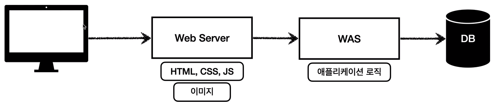
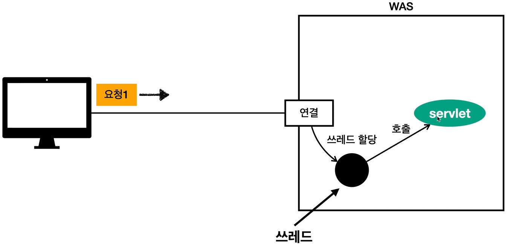

# 기본 개념 정리

## 목차
### [1. 웹 서버와 웹 애플리케이션 서버](#웹서버)
### [2. 서블릿](#서블릿)

## 웹 서버
* **HTTP 기반으로 동작**
    * 클라이언트가 HTTP를 요청을 하면 웹 서버에서 HTTP 프로토콜로 응답.
  
  
* **정적 리소스** 제공, 기타 부가 기능.
  * 정적(파일) HTML, CSS, JS
  * 이미지, 영상

## 웹 애플리케이션 서버(WAS)
* **HTTP 기반으로 동작**
    
  
* 기본적으로 웹 서버 기능을 포함하고, **프로그램 코드를 실행해서 애플리케이션 로직 수행을 통해 동적으로 제공**
    * 동적 HTML, HTTP API(JSON)
    * 서블릿, JSP, 스프링MVC
        
  
* `서블릿 컨테이너` 기능을 제공하면 `WAS`
    * 단 서블릿 없이 자바코드를 실행하는 서버 프레임워크도 있다.
        
  
* **애플리케이션 코드를 실행하는데 특화**되어 있음.

## 서버의 이상적인 설계

### 고려사항
* `WAS`만 사용하면 서버 과부화의 우려가 있다.
    * `애플리케이션 로직`의 비용이 비싸기 때문에 정적 리소스를 같이 제공을 하면 과부화 우려 발생.
    
  
* WAS 장애시 오류 화면 노출 불가능.
    
  

### 설계 방향
* 오류화면을 포함 한 **`정적 리소스`는 웹 서버가 처리**
    
  
* `애플리케이션 로직` 같은 동적인 처리가 필요하면 WAS에 요청을 위임한다.
    
  
* WAS는 `애플리케이션 로직`처리만 전담한다고 생각하자.

  
***

## 서블릿

### 등장배경
* 우리가 API를 개발해서 **웹 애플리케이션 서버를 직접 구현해 실행**한다고 하자. 필요한 것이 무엇이 있을까?

1. 소켓 연결
2. HTTP 요청 메세지 파싱
3. POST 방식, /save URL 인지
4. Content-Type 확인 (Html, Text, Img 등등..)
5. HTTP 메시지 바디 파싱
6. 저장 프로세스 실행
7. **비즈니스 로직 실행**
8. HTTP 응답 메시지 생성 시작
9. 응답 메시지가 성공적으로 보내지면 소켓 종료
     
우리는 7번의 비즈니스 로직을 실행하기 위해서 총 9단계의 과정을 거쳐야 한다.  
한 비즈니스의 로직을 위해서 반복적으로 이러한 단계들을 개발하는 것은 너무 비효율적이다. 이때 `서블릿`이 등장하였다.
   

### 서블릿의 특징
* 서블릿은 위에 설명한 비즈니스로직과 직접적으로 연관된 **7번 단계를 제외한 나머지 단계들을 모두 해결해 준다.**
    * HttpServletRequest : HTTP 요청 정보를 편리하게 사용
    * HttpServletResponse : HTTP 응답 정보를 편리하게 제공
  

* 이 기능들을 통해 HTTP 스펙을 매우 편리하게 사용 가능하다.

### 서블릿 컨테이너
* 서블릿 객체의 `생명주기`를 관리한다.(생성, 초기화, 호출, 종료)

* 서블릿 객체를 `싱글톤`으로 관리함
    * 최초 로딩 시점에 서블릿 객체를 미리 만들어두고 재활용
    * 모든 고객 요청은 동일한 서블릿 객체 인스턴스에 접근
    * 단 `공유 변수`의 사용을 주의.
    

* `JSP` 역시 서블릿으로 변환 되서 사용된다.
* 동시 요청을 위한 `멀티 쓰레드` 처리도 지원한다.

***

## 동시 요청 - 멀티 쓰레드
이제 클라이언트가 서버에 요청을 하면 서블릿을 통해 기본적인 틀을 만들고 비즈니스 로직을 끼워 넣기만 하면 된다 까지 배웠다.  
그러면 이 `서블릿`은 누가 호출해 주지? 바로 `쓰레드`이다.

### 특징
* **애플리케이션 코드를 하나하나 순차적으로 실행**하는 것을 `쓰레드`라고 한다.
* 쓰레드는 `한번에 하나의 코드 라인만 수행`하고 `동시 처리`가 필요하면 **쓰레드를 추가로 생성 할 수 있다.**
* **쓰레드가 없으면 자바 애플리케이션 실행 자체가 불가능하다.**
* 자바 메인 메서드를 처음 실행하면 `main`이라는 이름의 쓰레드가 실행이 된다.

### 단일 요청 (단일 쓰레드)

* 클라이언트의 요청 시 서버에서 유휴 쓰레드를 할당해서 서블릿 실행
* 서블릿의 응답 후 클라이언트로 응답이 되면 쓰레드가 유휴상태로 돌아감.

#### 문제점
* 단일 쓰레드의 경우 여러 클라이언트에서 `동시 요청`이 들어오면 서블릿을 불러들이는데 `처리지연`이 발생한다.

### 다중 요청 (멀티 쓰레드 등장)
멀티 쓰레드를 사용하는데에는 여러가지 방법들이 있다.

#### 1. 요청마다 `신규 쓰레드`를 생성
* 장점
  * 동시 요청 처리 가능
  * 리소스가 허용할 떄 까지 처리 가능
  * 하나의 쓰레드가 지연되도, 나머지 쓰레드는 정상 동작.
  
* 단점
  * 쓰레드의 생성비용이 매우 비싸기 때문에 요청마다 쓰레드를 생성하면, **응답속도가 느려짐.**
  * 컨텍스트 스위칭 비용이 발생한다.
  * 쓰레드 생성에 제한이 없다
    * 고객 요청이 너무 많이 오면, 리소스 임계점을 넘어서 서버가 죽을 수 있음.
  
#### 2. 쓰레드 풀 생성
* 일정 개수의 쓰레드를 만들어서 보관 및 관리. 요청이 있을 때 마다 빌려쓰고 `반환`을 함.
  * 이때 **쓰레드 개수는 조절이 가능**하다(톰캣 : 200개)
  * DB의 `커넥션 풀`과 같은 메커니즘이라 생각하면 된다.
* 최대 쓰레드가 모두 사용중이라 쓰레드 풀에 쓰레드가 없으면 특정 숫자만큼 대기하게 하고 거절하게끔 설정 가능

* 장점 
  * 쓰레드를 미리 생성하기 때문에, 쓰레드를 생성하고 종료하는 비용이 절약된다. (응답속도가 빠르다)
  * 생성 가능한 쓰레드의 최대치가 있기 때문에 서버가 죽을 걱정 없이 기존 요청을 안전하게 처리 할 수 있다.
  

#### 주의 사항
* `WAS`의 주요 튜닝 포인트는 `최대 쓰레드 개수`이다.
  * 너무 낮으면?
    * 서버 리소스는 여유롭지만, 클라이언트는 **응답 지연이 쉽게 발생한다.**
  * 너무 높으면?
    * CPU, 메모리 리소스 임계점 초과로 **서버 다운의 가능성이 높아진다.**

#### 쓰레드 풀 적정숫자 찾기
* 애플리케이션 로직의 복잡도, CPU, 메모리, IO의 리소스 상황에 따라 모두 다르다.
* 답은 `성능 테스트`
  * 최대한 실제 서비스와 유사하게 성능 테스트 시도.
  * `아파치 ab`, `제이미터`, `nGrinder(추천)`
  
#### 실무 팁
* 만약 장애가 발생한다면..
  * `클라우드`면 일단 서버부터 늘리고, 이후 튜닝
  * 클라우드가 아니면 바로 튜닝
  
  
### WAS의 멀티 쓰레드
* 사실 WAS가 멀티 쓰레드에 대한 대부분을 알아서 처리를 해준다.
  * 개발자는 `싱글 쓰레드 프로그래밍`을 하듯이 소스 코드를 개발하면 됨.
  * 단 멀티 쓰레드 환경이기 때문에 싱글톤 객체는 주의해서 사용하자.
  

### 스프링 웹 플럭스
* 특징
  * 비동기 넌-블러킹 처리
  * 최소 쓰레드로 최대 성능을 냄 (컨텍스트 스위칭 비용 최소화)
  * 함수형 스타일로 개발 (동시처리 코드 효율화)
  * 서블릿 기슬을 사용하지 않음
  
* 한계점
  * 기술적 난이도가 매우 높다
  * 아직 RDB 지원이 부족함
  * MVC쓰레드 모델도 충분히 빠름
  * 실무에서 많이 사용하지 않는다. (1%)