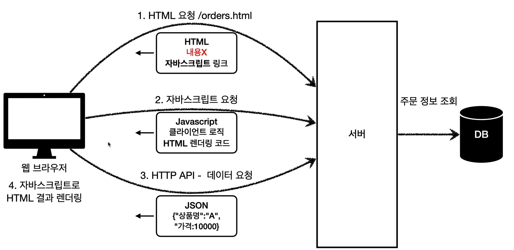

# 목차
## 리소스 종류

## [SSR, CSR](#SSR,_CSR)

***
## 리소스 종류

## 1. 정적 리소스
* 고정된 HTML 파일, CSS, JS, 이미지, 영상을 제공
* 웹 브라우저가 요청

## 2. 동적 HTML 페이지
* 서버가 DB를 조회해서 동적으로 HTML 생성 (by View 템플릿)
    * JSP, 타임리프 등등.
    
  
## 3. HTTP API
* 서버가 **HTML이 아닌 `데이터`를 전달**
* 주로 JSON 형식
* 데이터만 주고 받으며, UI가 필요하면 클라이언트가 별도로 처리함.

### 종류
* 일번적인 JS를 통한 HTTP 전송
* 웹 클라이언트 to 서버 (React, Vue.js)
* 앱 클라이언트 to 서버 (아이폰, 안드로이드, PC앱)
* 서버 to 서버
    * 주문 서버 -> 결제 서버
    * 기업간 데이터 통신
  
***

## SSR, CSR

### SSR (서버 사이드 렌더링)
* **HTML 최종 결과를 서버에서 만들어 웹 브라우저에 전달.**
* 주로 정적인 화면에 제공
* `JSP`, `타임리프`

### CSR (클라이언트 사이드 렌더링)

* **HTML 결과를 자바스크립트를 사용해 웹 브라우저에서 동적으로 생성해 적용**
* 주로 동적인 화면에 사용, 웹 환경을 앱 처럼 필요할 때마다 부분 변경이 가능하다.
* 구글 캘린더, 맵
* `React`, `Vue.js`

### 추가
* CSR + SSR을 동시에 지원하는 웹 프레임워크도 있다.
* SSR을 사용하더라도, 자바스크립트를 사용해서 화면 일부를 동적으로 변경 가능하다.